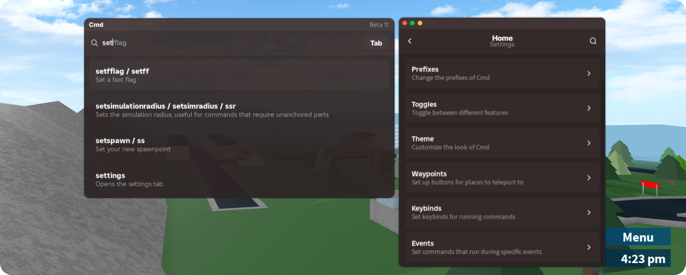

<div align="center">
<h1>Cmd 📜</h1>

<p>
  <a href="https://github.com/lxte/cmd/stargazers">
      
  </a>
  <a href="https://github.com/lxte/cmd/forks">
      
  </a>
  <a href="https://github.com/lxte/cmd/commits">
      
  </a>
</p>
</div>

# ⚙️ Features
- ⭐ 200+ Commands
- 🔌 Plugin system
- 🎨 Themes
- ⌨️ Keybinds
- 📅 Event-ran commands
- 📍 Waypoints

<br/> 

# ✨ Loadstring

## Main - Rewrite (Recommended) ⭐
```lua
loadstring(game:HttpGet("https://raw.githubusercontent.com/lxte/cmd/main/main.lua"))()
```

## Testing - Old Version (Not recommended) ⚠️
```lua
loadstring(game:HttpGet("https://raw.githubusercontent.com/lxte/cmd/main/testing-main.lua"))()
```
<br/>

# 🌐 Tutorials

- [🔌 Plugins](https://github.com/lxte/cmd/wiki/Plugins) - How to create your own **plugin**
- [🎨 Themes](https://github.com/lxte/cmd/wiki/Themes) - How to change your **Cmd theme**
  
# 🔨 Credits

- [👤 7kayoh](https://github.com/7kayoh) - UI Inspiration
- [👤 ImSnox](https://devforum.roblox.com/u/imsnox/summary) - UI Blur Module **(Old Version)**
